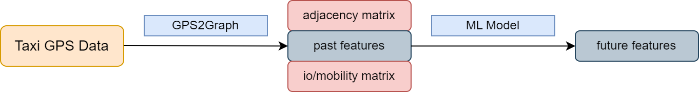
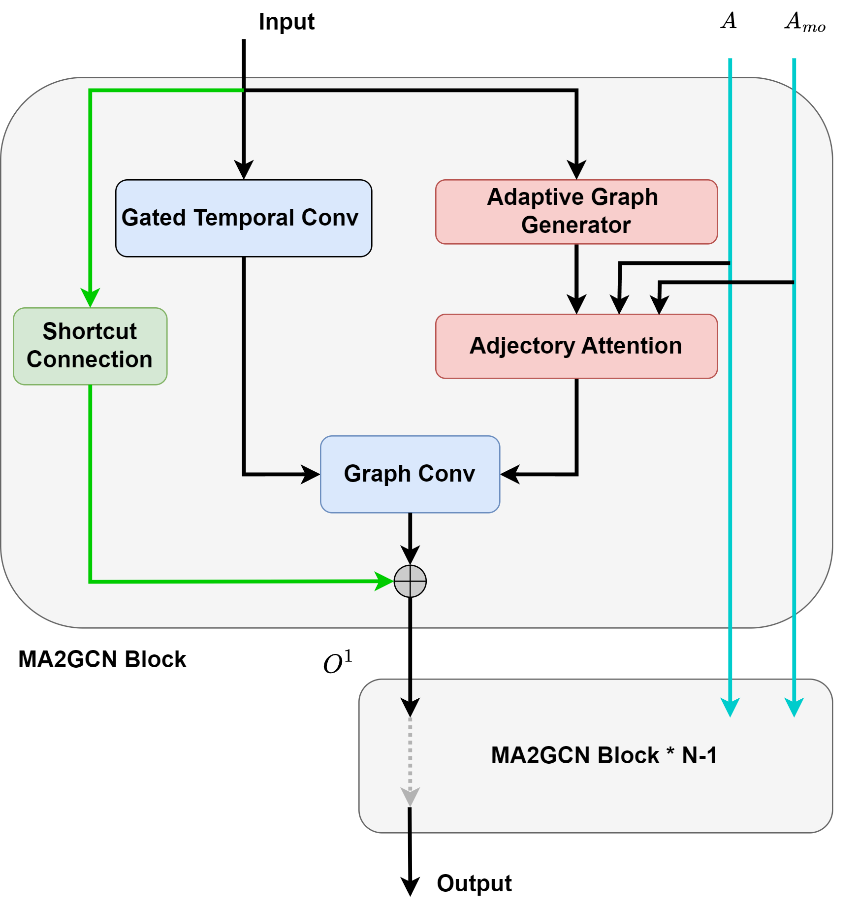
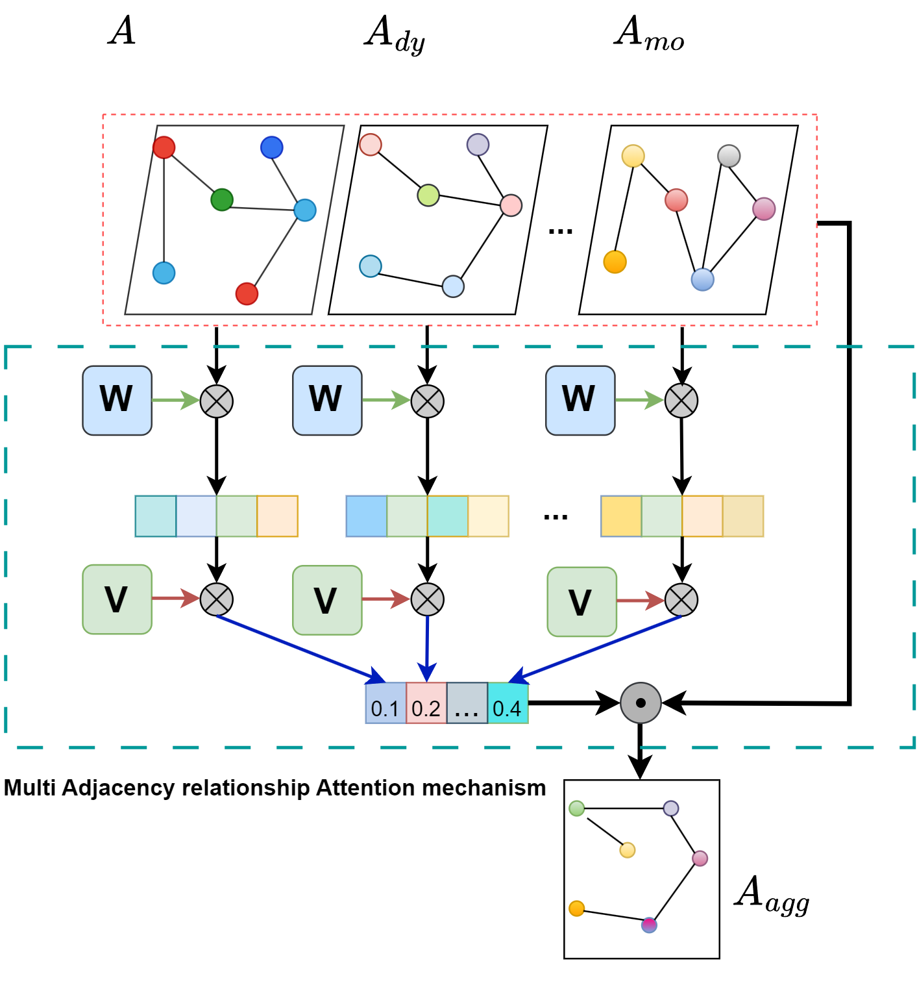

## Taxi Traffic Benchmark

### Pipeline

### Dataset

- [Shanghai Taxi](https://cse.hkust.edu.hk/scrg/)

### Baseline

- ARIMA
- SVR
- LSTM
- STGCN[[Paper]](https://arxiv.org/abs/1709.04875)[[Code](https://github.com/hazdzz/STGCN)]
- ASTGCN[[Paper]](https://ojs.aaai.org/index.php/AAAI/article/view/3881)[[Code](https://github.com/guoshnBJTU/ASTGCN-r-pytorch)]
- Graph WaveNet[[Paper]](https://arxiv.org/pdf/1906.00121)[[Code](https://github.com/nnzhan/Graph-WaveNet)]

### Proposed

MA2GCN(Multi Adjacency relationship Attention Graph Convolutional Networks)

**Architecture:**

**Multi Adjacency relationship Attention mechanism:**

### Related Links

- GPS2Graph [Link](https://github.com/zachysun/Gps2graph)

